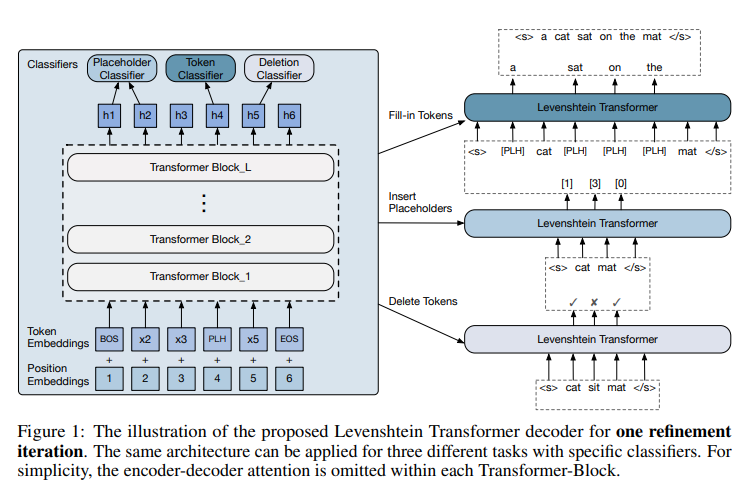

# Levenshtein Transformer

## 介绍
- 发表了一种Levenshtein Transformer（LevT）模型，这种生成模型由**插入**和**删除**操作构成。在翻译和总结方面能比strong Transformmer更精确，
同时更有效率
- 提出了一种相对应的**模仿学习**算法，能妥善处理上述两种策略的互补性和对立性。
- 这种模型集**生成**和**优化**于一体，这带来了一种灵活性，即用LevT模型训练的**翻译模型**可以直接用在**邮件订正**的工作上。

## 定义问题
### 序列的优化与生成
生成并优化序列问题可以扩展为MDP（Markov Decision Process）问题，定义为五元组（Y,A,E,R,y<sub>0</sub>）。
```
Y：序列集
A：操作集
E：环境
R：报酬
y<sub>0</sub>：初始序列集
```

机器人在环境E中，这个环境接受机器人的编辑操作，然后回馈一个调整后的序列。本文定义Y=V<sup>N<sub>max</sub></sup>。，N<sub>max</sub>代表最大长度，V是词汇记号。

每当decoding的时候，机器人会得到一个输入y，选择操作a，然后得到报酬r。我们用A代表操作集，用R代表报酬函数。
> 报酬函数R一般是**生成的序列**与**真实序列**的距离。R(y)=-D(y,y*)，比如[Levenshtein Distance](https://nymity.ch/sybilhunting/pdf/Levenshtein1966a.pdf)。

公式中的y<sub>0</sub> &isin; Y有关键作用。如果从其他系统得到这个初始序列，机器人将会学习如何优化这个序列。而若是初始序列为空，则变为普通的生成模型。

机器人有模型&pi;，代表当前序列下，可行操作的概率分布 &pi; : Y &rarr; P(A)。

### 操作：删除 & 插入
有子序列y<sub>k</sub>=（y<sup>1</sup>,y<sub>2</sub>,&hellip;,y<sub>3</sub>），
有两个基础操作**删除**和**插入**，可以生成序列y<sup>k+1</sup>=E(y<sup>k</sup>,a<sup>k+1</sup>)。其中y<sub>1</sub>和y<sub>n</sub>代表两个特殊符号\<s\>和\</s\>。后续内容会省略上下标，包括对MT（Machine Translation）甚至省略输入x。
> \<s\>\</s\>似乎代表了序列开始符号和序列结束符号

- 删除

删除操作针对输入**y**，对每一个y<sub>i</sub>有一个二元策略&pi;<sup>del</sup>(d | i,**y**)，1代表删除，0代表保持不变。其中&pi;<sup>del</sup>(d | 0,**y**)=&pi;<sup>del</sup>(d | n,**y**)=1，即第一个和最后一个不执行删除操作，防止越界。
> 这种手法在[GAN](https://arxiv.org/abs/1406.2661)的fine-grained discriminator中也能见到，用于预测每个token是真是假

- 插入

插入操作要复杂一点，包含两个部分：**placeholder预测**和**token预测**，这意味着它能在一个位置插入好几个token。首先策略&pi;<sup>plh</sup>(p | i,**y**)在所有的位置(y<sub>i</sub>,y<sub>i+1</sub>)预测是否插入一个placeholder,再以策略&pi;<sup>tok</sup>(t | i,**y**)将placeholder用实际token替换。这一套结构中的各个分类器能分别用在3个task上。
> 这种两阶段插入操作也能有用在[Insertion Transformer](https://arxiv.org/abs/1902.03249)和[Masked language model](https://arxiv.org/abs/1810.04805)。



- 策略组合

要注意以上策略是互补的，因此在操作的时候可以同时进行。每次循环分三步走：`删除token-插入placeholder-替换placeholder`。严谨来说，就是已有序列

预测操作


一次循环的计算式为


其中y&prime; 和y&Prime; 分别意味着E(y; ,d)和E(y&prime; ,p)

## Levenshtein Transformer

