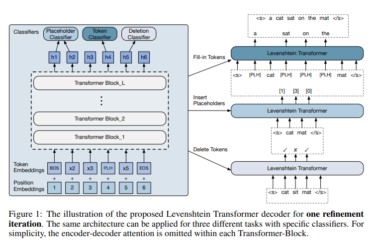
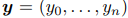
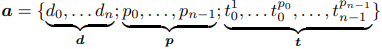
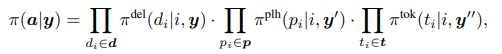
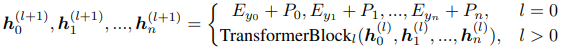
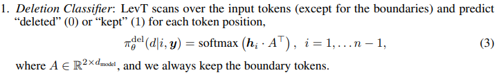
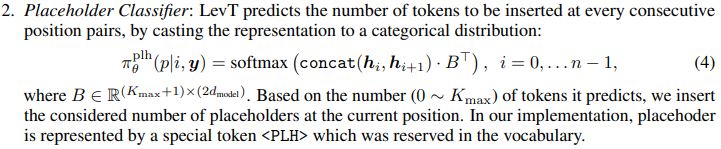
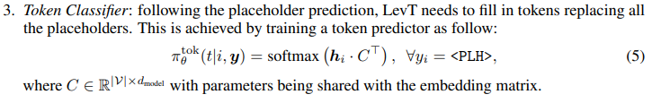

# Levenshtein Transformer

## 介绍
- 发表了一种Levenshtein Transformer（LevT）模型，这种生成模型由**插入**和**删除**操作构成。在翻译和总结方面能比strong Transformmer更精确，
同时更有效率
- 提出了一种相对应的**模仿学习**算法，能妥善处理上述两种策略的互补性和对立性。
- 这种模型集**生成**和**优化**于一体，这带来了一种灵活性，即用LevT模型训练的**翻译模型**可以直接用在**邮件订正**的工作上。

## 定义问题
### 序列的优化与生成
生成并优化序列问题可以扩展为MDP（Markov Decision Process）问题，定义为五元组（Y,A,E,R,y<sub>0</sub>）。
```
Y：序列集
A：操作集
E：环境
R：报酬
y0：初始序列集
```

机器人在环境E中，这个环境接受机器人的编辑操作，然后回馈一个调整后的序列。本文定义Y=V<sup>N<sub>max</sub></sup>。，N<sub>max</sub>代表最大长度，V是词汇记号。

每当decoding的时候，机器人会得到一个输入y，选择操作a，然后得到报酬r。我们用A代表操作集，用R代表报酬函数。
> 报酬函数R一般是**生成的序列**与**真实序列**的距离。R(y)=-D(y,y*)，比如[Levenshtein Distance](https://nymity.ch/sybilhunting/pdf/Levenshtein1966a.pdf)。

公式中的y<sub>0</sub> &isin; Y有关键作用。如果从其他系统得到这个初始序列，机器人将会学习如何优化这个序列。而若是初始序列为空，则变为普通的生成模型。

机器人有模型&pi;，代表当前序列下，可行操作的概率分布 &pi; : Y &rarr; P(A)。

### 操作：删除 & 插入
有子序列y<sub>k</sub>=（y<sup>1</sup>,y<sub>2</sub>,&hellip;,y<sub>3</sub>），
有两个基础操作**删除**和**插入**，可以生成序列y<sup>k+1</sup>=E(y<sup>k</sup>,a<sup>k+1</sup>)。其中y<sub>1</sub>和y<sub>n</sub>代表两个特殊符号\<s\>和\</s\>。后续内容会省略上下标，包括对MT（Machine Translation）甚至省略输入x。
> \<s\>\</s\>似乎代表了序列开始符号和序列结束符号

- 删除

  删除操作针对输入**y**，对每一个y<sub>i</sub>有一个二元策略&pi;<sup>del</sup>(d | i,**y**)，1代表删除，0代表保持不变。其中&pi;<sup>del</sup>(d | 0,**y**)=&pi;<sup>del</sup>(d | n,**y**)=1，即第一个和最后一个不执行删除操作，防止越界。
  > 这种手法在[GAN](https://arxiv.org/abs/1406.2661)的fine-grained discriminator中也能见到，用于预测每个token是真是假

- 插入

  插入操作要复杂一点，包含两个部分：**placeholder预测**和**token预测**，这意味着它能在一个位置插入好几个token。首先策略&pi;<sup>plh</sup>(p | i,**y**)在所有的位置(y<sub>i</sub>,y<sub>i+1</sub>)预测是否插入一个placeholder,再以策略&pi;<sup>tok</sup>(t | i,**y**)将placeholder用实际token替换。这一套结构中的各个分类器能分别用在3个task上。
  > 这种两阶段插入操作也能有用在[Insertion Transformer](https://arxiv.org/abs/1902.03249)和[Masked language model](https://arxiv.org/abs/1810.04805)。



- 策略组合

  要注意以上策略是互补的，因此在操作的时候可以同时进行。每次循环分三步走：`删除token-插入placeholder-替换placeholder`。严谨来说，就是已有序列

  预测操作

  

  一次循环为

  

  其中y&prime; 和y&Prime; 分别意味着E(y,d)和E(y&prime; ,p)

## Levenshtein Transformer

本章介绍Levenshtein Transformer和双策略学习算法。整体来说就是针对一串序列，反复进行**插入**和**删除**来进行*调整*，直至收敛。细节会放在附录。

### 模型
模型以Transformer为基础。Block间的状态迁移如下，



其中E的次元为|V|xd<sub>model</sub>，P的次元为N<sub>max</sub>xd<sub>model</sub>。上面Figure1展示了一次优化的过程。

- 策略分类器

decoder的输出(h<sub>0</sub>,h<sub>2</sub>,&hellip; ,h<sub>n</sub>)传入三个策略分类器：
  1. 删除分类器：针对所有token辨别是否需要删除，除了边界。
  
  2. Placeholder分类器：针对所有相邻的token辨别需要插入几个词汇。
  
  3. Token分类器：针对所有的Placeholder辨别用哪个词汇去替换。
  
- 共用Weight

  在Transformer的部分，上述三个策略decoder默认共用同一个。当然，也可以选择不共用，增加效用而不影响推演时间。

- 提前退出

  权衡精确度和计算资源，可以让&pi;<sup>del</sup>和&pi;<sup>plh</sup>的分类器接在中间block上，不需要三个操作都走整个Transformer。不过&pi;<sup>tok</sup>仍旧接最后一个block，因为预测单词的难度更大。

### 双策略学习

- 模仿学习

  训练Levenshtein Transformer的时候用到模仿学习，让机器人学习专业策略&pi;<sup>\*<\sup>。专业策略由实际target或经过[sequence distillation](https://arxiv.org/abs/1606.07947)的低噪音处理结果生成。目标在于最大化以下期待值：
  
  
